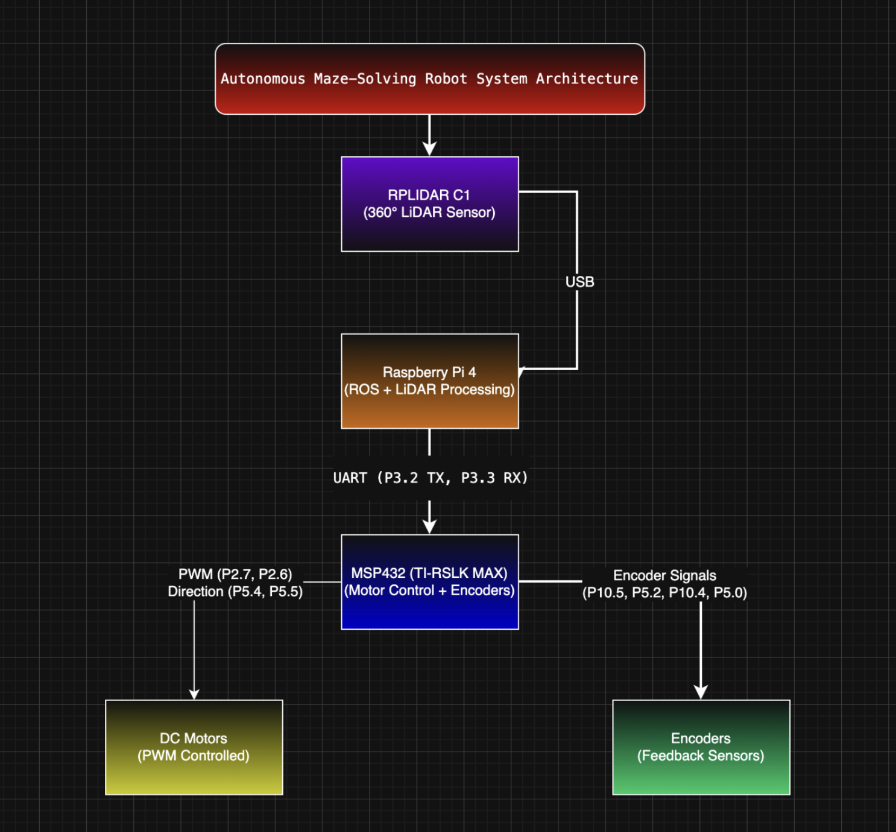

# Autonomous LiDAR-Based Navigation Robot  
**ECE 528 – Robotics and Embedded Systems (Final Project)**  
**Instructor:** Aaron Nanas  
**Authors:** Hamza Sulehria, Leo Issaghoulian  
**CSU Northridge – Department of Electrical and Computer Engineering**

---

## Introduction  
This project presents an autonomous mobile robot integrating embedded motor control with LiDAR-based sensing. The system combines a TI-RSLK MAX platform (MSP432) with a Raspberry Pi 4 for navigation logic.

---

## System Overview  

Two subsystems communicate via UART:

### Raspberry Pi  
- Processes LiDAR data  
- Detects obstacles  
- Sends commands (F, L, R, B, U, S)

### MSP432  
- Controls motors using PWM + GPIO  
- Executes movement commands  

---

## Demo Summary  

- Robot detects obstacles  
- Moves forward when clear  
- Turns when blocked  

### Testing Environment  
- 3-wall enclosure  
- Demonstrates basic navigation  

---

## Block Diagram  

---

## State Diagram  

---

## Hardware  

| Component | Purpose |
|----------|--------|
| TI-RSLK MAX | Motor control |
| Raspberry Pi 4 | LiDAR processing |
| RPLIDAR C1 | Distance sensing |

---

## Communication  

| Signal | MSP432 Pin |
|--------|-----------|
| TX | P3.2 |
| RX | P3.3 |
| GND | GND |

---

## Repository Structure  
msp432_ccs_project/
raspberry_pi/
images/
report/
demo/

---

## Video  

To be added.

---

## References  

[1] MSP432 Datasheet  
[2] TI-RSLK MAX Guide  
[3] Raspberry Pi 4  
[4] RPLIDAR C1  

